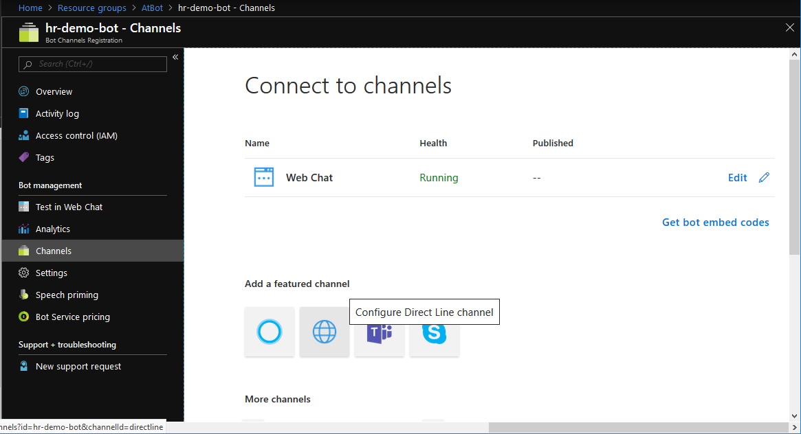
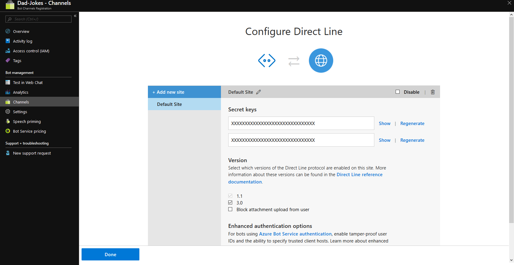
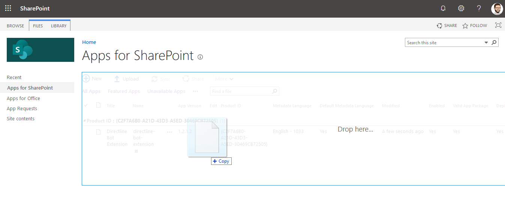
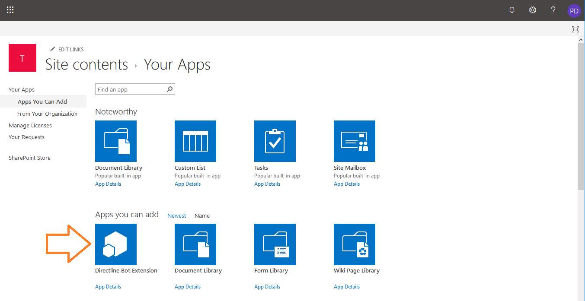

# Build a Custom Chat Bot with SharePoint Framework
> AtBot Integration with the SharePoint Framework

This article will review the steps to build a SharePoint Framework (SpFx) custom webpart with DirectLine integration.  With this application extension your users can interface with your Bot directly in SharePoint.  Since it is built on Azure Bot Channels and DirectLine, it can be easily connected with AtBot.


This webpart leverages several tools from Microsoft:
1. [SharePoint Framework](https://docs.microsoft.com/en-us/sharepoint/dev/spfx/sharepoint-framework-overview) - *"The SharePoint Framework (SPFx) is a page and web part model that provides full support for client-side SharePoint development, easy integration with SharePoint data, and support for open source tooling."*
2. Azure [Direct Line Channel](https://docs.microsoft.com/en-us/azure/bot-service/bot-service-channel-directline?view=azure-bot-service-4.0) - *"The Bot Framework Direct Line channel is an easy way to integrate your bot into your mobile app, webpage, or other application."*
2. [BotFramework WebChat](https://github.com/Microsoft/BotFramework-WebChat) - *"The Bot Framework Web Chat component is a highly-customizable web-based client for the Bot Framework V4 SDK. The Bot Framework SDK v4 enable developers to model conversation and build sophisticated bot applications."*

# What is AtBot
From [AtBot](https://atbot.io/):

*"AtBot is a bot-as-a-service platform that allows you to build complex chatbots without writing any code. AtBot provides answers to everyday questions and can automate business processes easily"*

To learn more about AtBot please visit the AtBot website (https://atbot.io/) and documentation at https://admin.atbot.io/Docs

# Getting Started
You will need some background with Office 365, Azure and the SharePoint Framework.  If you are new to this I recommend following tutorial documentation for SpFx before getting started.

## Office 365
Some actions in this article will require administrative privilages to Office 365 and Azure.  If you're like me you may not have administrative access to your company's Office365/Azure subscriptions.  The good news is, you can get free trials for everything:

1. Navigate to https://dev.office.com.  Look for the link to "join the Office 365 Developer program"
2. Sign up for free Azure credits at https://azure.microsoft.com/en-us/free/ai/

## SharePoint Framework
To build & deploy SpFx webparts requires some development environment set up.  These steps are reviewed in detail at https://docs.microsoft.com/en-us/sharepoint/dev/spfx/set-up-your-developer-tenant

Make sure to follow steps for Setting up your Office 365 Tenant and Set up your Development Environment.  If you are new to SpFx it wouldn't be a bad idea to run through the tutorial to [build your first hello world web part](https://docs.microsoft.com/en-us/sharepoint/dev/spfx/web-parts/get-started/build-a-hello-world-web-part)

## AtBot
This JumpStart worksheet is what I used to get familiar with the basics.  Office 365 and Azure Subscription administrative access is a prerequisite.  The jumpstart worksheet contains information on how to start a free trial with AtBot. 

https://admin.atbot.io/content/Atbot%20Jump%20Start%20Guide.pdf


# Minimal Path for Debugging
Follow these steps to start debugging right away.  Read further for additional guidance.

1. Set up Prerequisites
    1. Office 365 Subscription & administrative access
    2. Azure Subscription
    4. SpFx Development Environment
11. Create a Bot Channel Registration in Azure
    1. Create a Direct Line Channel in the bot.  Copy one of the Direct Line Secret Keys for use later.
3. Clone the app repository & install dependencies - https://github.com/withum-digital/directline-bot-extension
5. Start the debugger from command line
    1. gulp serve --nobrowser
6. Open a SharePoint site collection and paste the debug query string at the end (sample below in Debugging chapter - replace bot name and direct line secret)


# Prerequisites
This article assumes you have followed the prerequisite steps above already including having administrative access to Office 365, Azure and SharePoint Online.

# Direct Line Channel & Secret
In order for the SpFx app to communicate with Azure, a Direct Line Channel must be created through Azure.

Navigate to your Bot Channel Registration blade in azure and select "Channels" from the menu.  Select Direct Line Channel under "add a featured channel"



Once the channel is created, navigate into it using the edit link and copy one of the secret keys.  This will be used later during debugging and deployment



# SpFx Extension Clone and Install
Clone the source code for the SpFx DirectLine App and install NPM dependencies.  If you are having trouble here please read through the guidance from Microsoft on how to set up your development environment for SpFx: https://docs.microsoft.com/en-us/sharepoint/dev/spfx/set-up-your-developer-tenant

```bash
git clone https://github.com/withum-digital/directline-bot-extension
cd directline-bot-extension
npm i
```

# Debugging
To debug the application extension, execute the gulp command to host a local web server:

```bash
gulp serve --nobrowser
```

Next, open any SharePoint 365 site collection and paste the debug query string below to the end of the URL.  You will be prompted from SharePoint if you would like to Allow debug scripts.  Answering allow will load the SharePoint page with the DirectLine Bot Extension (screenshot below)

```
?loadSPFX=true&debugManifestsFile=https://localhost:4321/temp/manifests.js&customActions={"21d2dffd-4f4e-461c-99d4-047c10b21d19":{"location":"ClientSideExtension.ApplicationCustomizer","properties":{"DirectLineSecret":"YOUR DIRECTLINE SECRET GOES HERE", "BotName": "YOUR BOT NAME GOES HERE"}}}
```
>Paste the query string above to the end of the URL for a SharePoint Online site collection to load the DirectLine extension for debugging

>**Important** Replace the DirectLineSecret setting in the query string with the secret you copied from Azure in the DirectLine Channel step above.  The title should also be replaced with a the Bot title (although this is cosmetic and the bot should still load)


>After accepting the prompt you should see the chat bubble appear on the page

# Deployment

## App Catalog
A prerequisite for deployment is to have an App Catalog site collection for SharePoint.  Detailed guidance to create an app catalog is published by Microsoft here:  https://docs.microsoft.com/en-us/sharepoint/use-app-catalog?redirectSourcePath=%252fen-us%252farticle%252fuse-the-app-catalog-to-make-custom-business-apps-available-for-your-sharepoint-online-environment-0b6ab336-8b83-423f-a06b-bcc52861cba0

## Update the DirectLine Secret
Navigate to ./sharepoint/assets/elements.xml and update this file with your bot's name and DirectLine Secret (copied above).

```xml
<?xml version="1.0" encoding="utf-8"?>
<Elements xmlns="http://schemas.microsoft.com/sharepoint/">
    <CustomAction
        Title="DirectlineBotExtension"
        Location="ClientSideExtension.ApplicationCustomizer"
        ClientSideComponentId="15be81a7-b6b8-4a75-8de3-0da288492e77"
        ClientSideComponentProperties="{&quot;BotName&quot;:&quot;<!-- YOUR BOT NAME HERE -->&quot;, &quot;DirectLineSecret&quot;:&quot;<!-- YOUR BOT DIRECTLINE SECRET HERE-->&quot;}">
    </CustomAction>
</Elements>
```

>**Important** - Your secret may contain special characters which need to be escaped before they will build property into the solution.  If you're having trouble connecting to your bot, this could be the culprit.  Scan your DirectLine secret for characters like & ' " < >

## Build the Project
To install the DirectLine Bot Extension to your SharePoint environment, first package the solution:

```bash
gulp bundle --ship
gulp package-solution --ship
```

Once these commands are complete, a .pkg file will be added to a ./sharepoint/solution folder.  From here, drag and drop the .pkg file into the app catalog:



# Add App to SharePoint Site
Once the app has been deployed to the SharePoint App Catalog, it is ready to be deployed to a site collection.

Navigate to Site Contents and click on "New" -> "App".  The App Should now appear for selection in the next window.




# Summary
The SharePoint Framework enables an organization to add customizations to SharePoint online through modern client-side development platforms.  For Bots, SpFx gives full control over the user experience such as look and feel, or where/how the Bot should appear.  Using AtBot makes Bot development easier by offering a no-code approach and integrations with Azure services like [QnA Maker](https://www.qnamaker.ai/) and Microsoft Flow.

For questions about this article or other SpFx/Azure/Bot/AI topics please don't hesitate to reach out to me or one of my colleagues at Withum.

# Resources
* Git Repository - https://github.com/withum-digital/directline-bot-extension
* AtBot - https://atbot.io/

<style typ="text/css">
ol ol { list-style-type: lower-alpha; }
</style>


